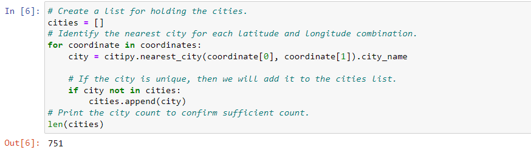
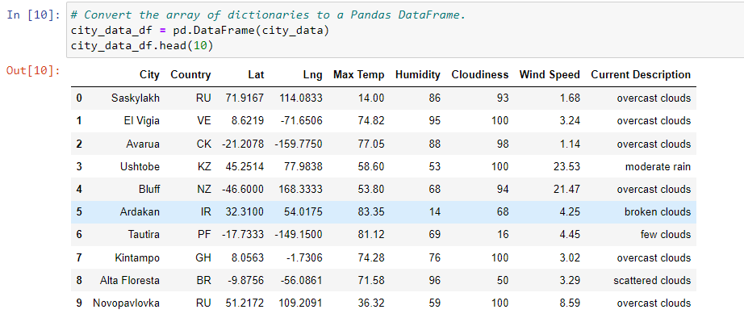

# World_Weather_Analysis
The objective of this project was to randomly generate 2000 locations to then find the nearest city for those items through the use of API calls.
The deliverables were as follows.
- Retrieve Weather Data.
- Create a Customer Travel Destination Map.
- Create a Travel Itenerary Map.

## Source Data Info
The locations were randomly generated through code and then utilized through the Open Weather website and Google Maps.

## Results
### Retrieve Weather Data
Of the 2000 randomly generated locations the code was able to identify 751 cities.

After running this data through the Open Weather website I was able to return information on 697 of those cities and convert the stored data (City Name, Latitude, Longitude, Max Temp, Humidity, Clouds, Wind Speed, and Current Weather Conditions) to a DataFrame.

### Create a Customer Travel Destination Map
I was then able to filter this list using a customer preference of temperature ranges and create a list of potential travel locations along with nearby hotels. These were processed through Google Maps to return potential hotels along with pop up markers.

### Create a Travel Itinerary Map
This was completed using Google Directions API to create a route for 4 locations.

